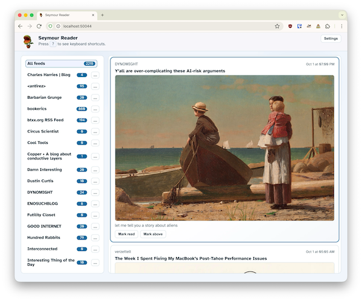

# Seymour

Seymour is a lightweight, single-binary RSS/Atom reader built on Bun and SQLite. It runs locally or on a small VM, keeps your feeds updated on a schedule, and serves a clean UI for skimming unread items.

<p align="center">
  
</p>

## Features
- Self-hosted reader with periodic fetching that respects `ETag`/`Last-Modified` and backs off on 429s or feeds without validators.
- SQLite-backed storage (default database at `data/reader.sqlite`).
- Add feeds one-by-one or import OPML; edit or delete subscriptions at any time.
- Unread-focused UI with per-feed filtering, inline mark-as-read, and mark-above-as-read controls.
- Manual refresh trigger alongside automatic background fetching.
- Optional Basic Auth via `APP_PASSWORD` for shared deployments.

## Requirements
- [Bun](https://bun.sh/) runtime.
- SQLite is bundled with Bun; no extra services required.

## Quick start
```bash
git clone https://github.com/you/seymour.git
cd seymour
bun install

# Optional: protect the instance
export APP_PASSWORD=changeme

# Develop with auto-reload
bun dev

# Or run once
bun start
```

Visit `http://localhost:3000` (or your configured `PORT`). Open Settings to add a feed URL or upload an OPML file. Click entries to open them; use the buttons to mark items or refresh.

## Configuration
Environment variables:
- `PORT` (default `3000`)
- `PAGE_SIZE` number of unread entries to show (default `50`)
- `APP_PASSWORD` enables Basic Auth
- `FETCH_INTERVAL_MS` fetch cadence in milliseconds (default 30 minutes)
- `FETCH_TIMEOUT_MS` per-request timeout in milliseconds (default `15000`)
- `HTTP_USER_AGENT` override the fetcher user agent
- `DB_PATH` alternate SQLite path (default `data/reader.sqlite`)

## Data & storage
- The `data/` directory is created at runtime and holds the SQLite database; keep it out of version control.
- Back up or migrate by copying `data/reader.sqlite` (or your custom `DB_PATH`).

## Self-hosting tips
- Run with `PORT=4000 APP_PASSWORD=secret bun start` behind a reverse proxy or on a private network.
- Adjust `FETCH_INTERVAL_MS` thoughtfully; the default is intentionally conservative. Feeds lacking `ETag`/`Last-Modified` headers and any 429 responses are automatically slowed down.
- Set `HTTP_USER_AGENT` if you want a custom identifier when fetching feeds.

## Project layout
- `src/server.ts` – Bun entrypoint and routing.
- `src/feed-fetcher.ts` / `src/feed-parser.ts` – scheduled fetching and RSS/Atom parsing.
- `src/db.ts` – SQLite schema and queries.
- `src/html.ts` – server-rendered UI.
- `src/opml.ts` – OPML import handling.
