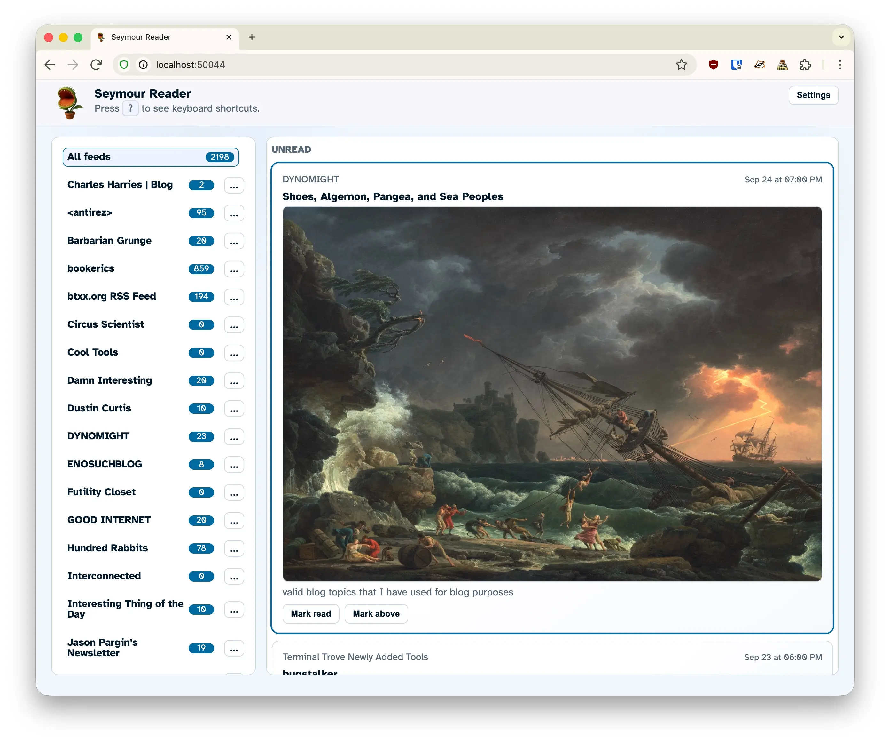
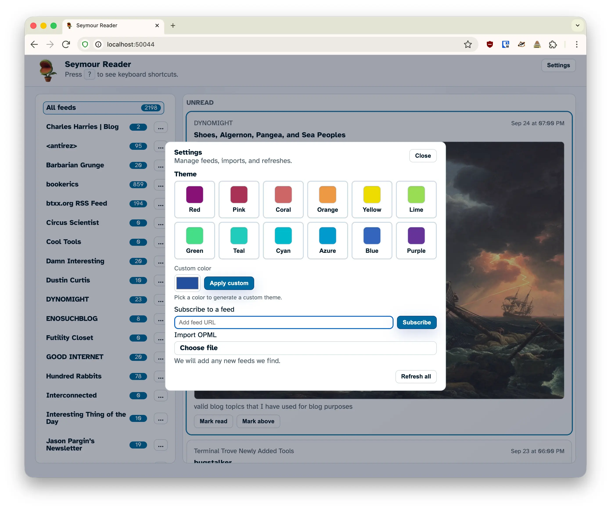

# Seymour

Seymour is a lightweight, single-binary RSS/Atom reader built on Bun and SQLite. It runs locally or on a small VM, keeps your feeds updated on a schedule, and serves a clean UI for skimming unread items.

<p align="center">
  
</p>

<p align="center">
  
</p>

## Features
- Self-hosted reader with periodic fetching that respects `ETag`/`Last-Modified`, backs off on 429s, and handles network interruptions gracefully (persisted backoff survives restarts; local network errors use shorter retry windows).
- SQLite-backed storage (default database at `data/reader.sqlite`).
- Add feeds one-by-one or import OPML; edit or delete subscriptions at any time.
- Unread-focused UI with per-feed filtering, inline mark-as-read, mark-above-as-read, and “mark all read” (global or per-subscription).
- Safe rendering of feed summaries (sanitized; malformed markup won’t break the UI).
- Manual refresh trigger alongside automatic background fetching.
- Optional Basic Auth via `APP_PASSWORD` for shared deployments.
- **Modern theming system** with 12 predefined color schemes from the [12-bit rainbow palette](https://iamkate.com/data/12-bit-rainbow/) (Red, Pink, Coral, Orange, Yellow, Lime, Green, Teal, Cyan, Azure, Blue, Purple) plus custom color support using OKLCH color space for perceptually uniform colors across light and dark modes.

## Default Shortcuts
| Key | Action |
| --- | --- |
| `j` | Next item |
| `k` | Previous item |
| `v` | Open current link in a new tab |
| `m` | Mark current read |
| `Shift+M` | Mark current and above read |
| `u` | Toggle unread/all view |
| `r` | Refresh all feeds |
| `a` | View all feeds |
| `?` | Toggle the shortcuts overlay |

## Requirements
- [Bun](https://bun.sh/) runtime.
- SQLite is bundled with Bun; no extra services required.

## Quick start
```bash
git clone https://github.com/you/seymour.git
cd seymour
bun install

# Optional: protect the instance
export APP_PASSWORD=changeme

# Develop with auto-reload
bun dev

# Or run once
bun start
```

Visit `http://localhost:50044` (or your configured `PORT`). Open Settings to add a feed URL or upload an OPML file. Entries are automatically marked as read as you scroll past them. Toggle between "Unread" and "All" views to re-read entries.

## Run as a macOS service (launchd)
If you want Seymour to run in the background without an open terminal, you can install a per-user LaunchAgent (starts at login and restarts on crash).

```bash
# One-time setup (creates ~/Library/LaunchAgents/com.seymour.plist)
bun run service:install

# Start / restart
bun run service:restart

# Stop
bun run service:stop

# Remove the LaunchAgent plist (stop first)
bun run service:uninstall
```

To configure Seymour for launchd, edit `~/Library/LaunchAgents/com.seymour.plist` and add any desired `EnvironmentVariables` like `PORT`, `DB_PATH`, `APP_PASSWORD`, etc, then run `bun run service:restart`.

If `bun` isn’t on launchd’s PATH on your machine, run `BUN_PATH="$(command -v bun)" bun run service:install` to bake the absolute Bun path into the plist.

Logs:
```bash
tail -f ~/Library/Logs/seymour.log
tail -f ~/Library/Logs/seymour.error.log
```

## Configuration
Environment variables:
- `PORT` (default `50044`)
- `PAGE_SIZE` number of unread entries to show (default `50`)
- `APP_PASSWORD` enables Basic Auth
- `FETCH_INTERVAL_MS` fetch cadence in milliseconds (default 30 minutes)
- `FETCH_TIMEOUT_MS` per-request timeout in milliseconds (default `45000`)
- `HTTP_USER_AGENT` override the fetcher user agent
- `DB_PATH` alternate SQLite path (default `data/reader.sqlite`)

## Data & storage
- The `data/` directory is created at runtime and holds the SQLite database; keep it out of version control.
- Back up or migrate by copying `data/reader.sqlite` (or your custom `DB_PATH`).

## Self-hosting tips
- Run with `PORT=4000 APP_PASSWORD=secret bun start` behind a reverse proxy or on a private network.
- Adjust `FETCH_INTERVAL_MS` thoughtfully; the default is intentionally conservative. Feeds lacking `ETag`/`Last-Modified` headers are polled less frequently (90 min), 429 responses honor `Retry-After` (or default to 2 hours), and backoff state is persisted so restarts don't cause a thundering herd of requests.
- Set `HTTP_USER_AGENT` if you want a custom identifier when fetching feeds.

## Project layout
- `src/server.ts` – Bun entrypoint and routing.
- `src/feed-fetcher.ts` / `src/feed-parser.ts` – scheduled fetching and RSS/Atom parsing.
- `src/db.ts` – SQLite schema and queries.
- `src/html.ts` – server-rendered UI.
- `src/opml.ts` – OPML import handling.
